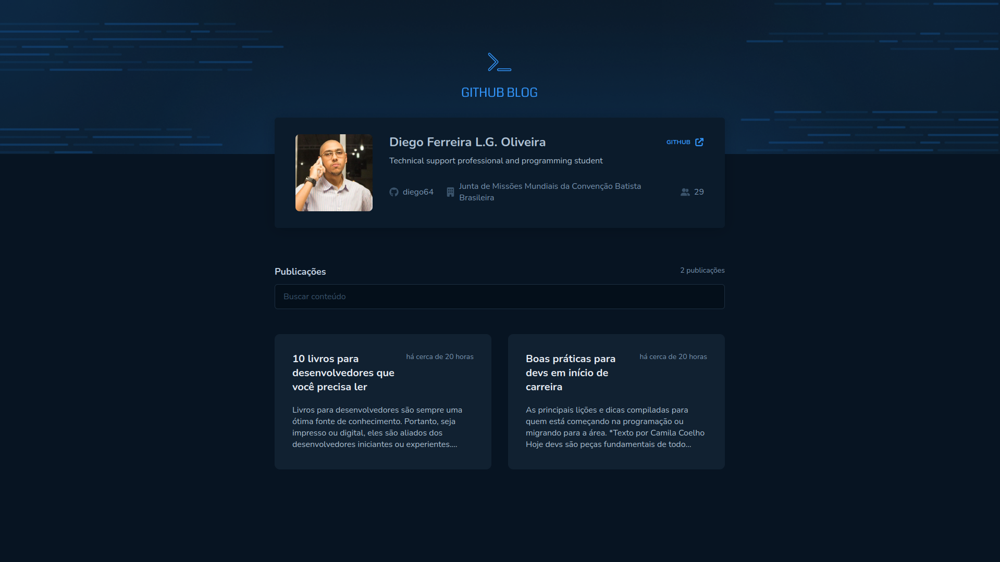

## Github Blog

<h1 align="center">
    
</h1>

### Objetivo

Desenvolver uma aplicação que utilizará da API do GitHub para buscar issues de um repositório, dados do seu perfil e exibir elas como um blog.

### Stack utilizada

**Front-end:** React.JS, Typescript, Styled Components e Axios.

### Funcionalidades

- Listagem do seu perfil com imagem, número de seguidores, nome e outras informações disponíveis pela API do GitHub.
- Listar e filtrar todas as issues do repositório com um pequeno resumo do conteúdo dela

## Rodando o Projeto

Clone o projeto

```bash
  git clone https://github.com/diego64/https://github.com/diego64/desafio-03-reactjs
```

Entre no diretório do projeto

```bash
  cd desafio-03-reactjs
```

Instale as dependências

```bash
  npm install
```

Inicie o servidor

```bash
  npm run dev
```